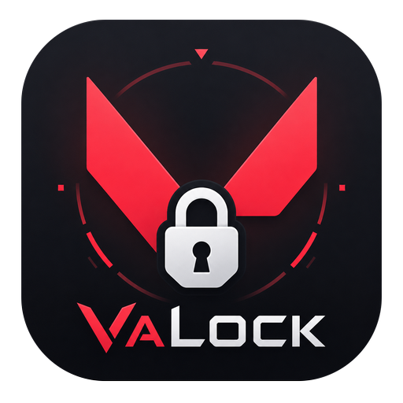

# VaLock - Valorant Insta-Lock Assistant

<div align="center">
  
  <h3>A native Rust desktop application for automatic agent selection in Valorant</h3>
</div>

---

## Overview

VaLock is a Valorant companion tool that automatically selects and locks your preferred agent during the agent selection phase. Configure your agent preferences per map or use a single agent for all maps, then let VaLock handle the rest.

**Built with:** Tauri 1.4 + React 18 + Rust (no Python dependency)

---

## Features

- **Per-Map Agent Configuration** - Set different agents for different maps
- **All-Maps Mode** - One agent for every map
- **Multiple Profiles** - Create separate configurations for ranked, casual, different playstyles
- **Native Performance** - Pure Rust backend, no Python runtime required
- **Real-time Status** - Live monitoring indicator in the status bar
- **Valorant-Themed UI** - Dark theme matching the game's aesthetic

---

## Installation

### Download
1. Go to the [Releases](https://github.com/mahdigholami099/VaLock/releases) page
2. Download the latest `VaLock_X.X.X_x64-setup.exe` (NSIS installer)
3. Run the installer and follow the prompts

### Requirements
- Windows 10/11 (64-bit)
- Valorant installed and updated
- Riot Client running

---

## How to Use

### First Time Setup

1. **Launch VaLock** - The app will create its configuration directory at `%APPDATA%\VaLock\`

2. **Create a Profile** (optional but recommended)
   - Navigate to **Profiles** in the sidebar
   - Enter a profile name (e.g., "Ranked", "Casual", "Flex")
   - Click **Add**
   - Select the profile from the dropdown in the sidebar footer

3. **Configure Your Agents**

   **Option A: All Maps (Single Agent)**
   - Click **All Maps** in the sidebar
   - Select your preferred agent from the grid
   - Click **Save Configuration**

   **Option B: Each Map (Different Agents)**
   - Click **Each Map** in the sidebar
   - Select a map from the grid
   - Choose an agent for that map
   - Repeat for each map you want to configure
   - Click **Save Configuration** after each map

4. **Start Insta-Lock**
   - Return to **Home**
   - Click **Start Insta-Lock** (button changes to **Stop Insta-Lock** when active)
   - The status bar will show "Waiting for match..." then "Locked [Agent]! Good luck!"

### During Gameplay

1. Queue for a match in Valorant (any mode with agent selection)
2. When the agent selection screen appears, VaLock will automatically:
   - Detect the map
   - Look up your configured agent for that map
   - Select and lock the agent
3. Play your game!

---

## Configuration Files

All data is stored in `%APPDATA%\VaLock\`:

```
%APPDATA%\VaLock\
├── active              # Currently active profile name
└── profiles\
    ├── default         # Default profile config
    ├── ranked          # Your ranked profile
    └── ...             # Additional profiles
```

Profile format (JSON):
```json
{
  "Ascent": "Jett",
  "Bind": "Raze",
  "Haven": "Sova",
  "...": "..."
}
```

---

## Building from Source

### Prerequisites
- [Rust](https://rustup.rs/) (latest stable)
- [Node.js](https://nodejs.org/) (v18+)
- [Git](https://git-scm.com/)

### Build Steps
```bash
# Clone the repository
git clone https://github.com/mahdigholami099/VaLock.git
cd VaLock

# Install frontend dependencies
npm install

# Build the application
npm run tauri build
```

### Output
- `src-tauri/target/release/bundle/nsis/VaLock_X.X.X_x64-setup.exe` - NSIS installer
- `src-tauri/target/release/bundle/msi/VaLock_X.X.X_x64_en-US.msi` - MSI installer

---

## How It Works

VaLock uses the **Riot Client Local API** (documented by the community) to interact with the Valorant client:

1. **Lockfile Parsing** - Reads the Riot Client lockfile to get the local API port and password
2. **Authentication** - Obtains Bearer token and Entitlements JWT from the local API
3. **Log Monitoring** - Polls `ShooterGame.log` for pregame match URLs
4. **Agent Selection** - When a match is detected, sends SELECT and LOCK requests to the local API

> **Note:** This only uses the **local** Riot Client API (127.0.0.1). No requests are sent to Riot's external servers for agent selection.

---

## Legal Disclaimer

### ⚠️ IMPORTANT - READ BEFORE USE

**VaLock is an unofficial third-party tool. It is not affiliated with, endorsed by, or approved by Riot Games, Inc.**

### No Warranty
This software is provided "AS IS", without warranty of any kind, express or implied, including but not limited to the warranties of merchantability, fitness for a particular purpose, and non-infringement.

### Limitation of Liability
**The authors and contributors shall not be liable for any claim, damages, or other liability arising from:**
- Use or inability to use this software
- Account penalties, bans, or restrictions from Riot Games
- Data loss, corruption, or security issues
- Any direct, indirect, incidental, special, exemplary, or consequential damages

### Use at Your Own Risk
- **This tool modifies the normal game flow** by automating agent selection
- **Riot Games' Terms of Service** prohibit automation, botting, and third-party software that interacts with the game client
- **Account penalties are possible** including temporary/permanent bans
- **The developers assume NO responsibility** for any consequences to your Valorant account, Riot account, or computer system

### By Using This Software, You Acknowledge That:
1. You understand this is unofficial third-party software
2. You accept all risks associated with its use
3. You will not hold the developers liable for any damages or penalties
4. You comply with all applicable laws and Riot Games' Terms of Service

---

## Privacy

- **No data collection** - VaLock does not collect, transmit, or store any personal data
- **No external connections** - All API calls go to `127.0.0.1` (local Riot Client) and `valorant-api.com` (public game data)
- **Local storage only** - Configuration stays on your machine at `%APPDATA%\VaLock\`

---

## Troubleshooting

| Issue | Solution |
|-------|----------|
| "Insta-Lock is already running" | Wait for current session to finish or click Stop first |
| Agent not locking | Ensure Riot Client is running; check profile has agents configured for the map |
| "Waiting for match..." never changes | Verify you're in a queue with agent selection (not Deathmatch, Spike Rush, etc.) |
| Permission errors | Run as Administrator; ensure antivirus isn't blocking the app |

---

## Contributing

Contributions are welcome! Please read [CONTRIBUTING.md](CONTRIBUTING.md) for guidelines.

---

## License

MIT License - See [LICENSE](LICENSE) for details.

---

## Credits

- **Valorant API** - [valorant-api.com](https://valorant-api.com/) for agent/map data
- **Tauri** - [tauri.app](https://tauri.app/) for the desktop framework
- **Community** - Riot Client Local API documentation by the Valorant modding community

---

<div align="center">
  <strong>Use responsibly. Play fair. Have fun.</strong>
</div>